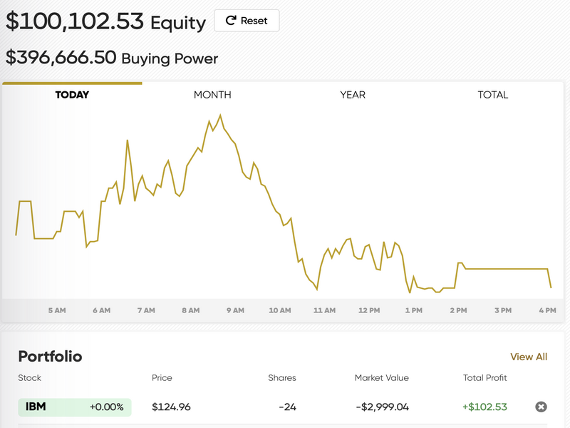

[![Contributors][contributors-shield]][contributors-url]
[![Forks][forks-shield]][forks-url]
[![Stargazers][stars-shield]][stars-url]
[![Issues][issues-shield]][issues-url]
[![MIT License][license-shield]][license-url]
[![LinkedIn][linkedin-shield]][linkedin-url]

<!-- TABLE OF CONTENTS -->
<details open="open">
  <summary>Table of Contents</summary>
  <ol>
    <li>
      <a href="#about-the-project">About The Project</a>
      <ul>
        <li><a href="#built-with">Built With</a></li>
      </ul>
    </li>
    <li>
      <a href="#getting-started">Getting Started</a>
      <ul>
        <li><a href="#prerequisites">Prerequisites</a></li>
        <li><a href="#installation">Installation</a></li>
      </ul>
    </li>
    <li><a href="#usage">Usage</a></li>
    <li><a href="#roadmap">Roadmap</a></li>
    <li><a href="#contributing">Contributing</a></li>
    <li><a href="#license">License</a></li>
    <li><a href="#contact">Contact</a></li>
    <li><a href="#acknowledgements">Acknowledgements</a></li>
  </ol>
</details>


<!-- ABOUT THE PROJECT -->
## About The Project
<p align="center">
  
</p>

Python program that learns stock movement based on past and current data and buy/sells stocks accordingly. Implemented with the Alpaca Trading API to import data and create buy/sell orders, the AI software can predict future movements of stocks and place orders automatically. It's also deployed to the Google Cloud Storage to run infinitely on Google Cloud.

### Built With
* [Python](https://www.python.org/)
* [Keras](https://keras.io/)
* [scikit-learn](https://scikit-learn.org/)
* [Numpy](https://numpy.org/)
* [Pandas](https://pandas.pydata.org/)
* [Google Cloud Platform](https://cloud.google.com/)


## Getting Started
### Prerequisites
* Python
  ```sh
  https://www.python.org/downloads/
  ```

### Installation
1. Get a free key_id and secret_key at [https://alpaca.markets/algotrading](https://alpaca.markets/algotrading)
2. Clone the repo
   ```sh
   git clone https://github.com/rexliu3/StockTradingBotCloud.git
   ```
3. Install requirement.txt
   ```sh
   pip3 install -r requirements.txt
   ```
4. Enter your key_id and secret_key in `Stock_Trading_Bot.py`
   ```PY
   super().__init__(key_id='ENTER YOUR KEY_ID',
                                                secret_key='ENTER YOUR SECRET_KEY',
                                                base_url='https://paper-api.alpaca.markets')
   ```


<!-- USAGE EXAMPLES -->
## Usage
Simply run `main.py`: ``` python3 main.py ```


<!-- ROADMAP -->
## Roadmap
See the [open issues](https://github.com/rexliu3/StockTradingBotCloud/issues) for a list of proposed features (and known issues).


<!-- CONTRIBUTING -->
## Contributing
Contributions are what make the open source community such an amazing place to be learn, inspire, and create. Any contributions you make are **greatly appreciated**.

1. Fork the Project
2. Create your Feature Branch (`git checkout -b feature/AmazingFeature`)
3. Commit your Changes (`git commit -m 'Add some AmazingFeature'`)
4. Push to the Branch (`git push origin feature/AmazingFeature`)
5. Open a Pull Request


<!-- LICENSE -->
## License
Distributed under the MIT License. See `LICENSE` for more information.


<!-- CONTACT -->
## Contact
Rex Liu - rexliu3@berkeley.edu

Project Link: [https://github.com/rexliu3/StockTradingBotCloud](https://github.com/rexliu3/StockTradingBotCloud)


## Acknowledgements
Built with reference to [article](https://medium.com/swlh/build-an-ai-stock-trading-bot-for-free-4a46bec2a18)


[contributors-shield]: https://img.shields.io/github/contributors/rexliu3/StockTradingBotCloud?style=for-the-badge
[contributors-url]: https://github.com/rexliu3/StockTradingBotCloud/graphs/contributors
[forks-shield]: https://img.shields.io/github/forks/rexliu3/StockTradingBotCloud?style=for-the-badge
[forks-url]: https://github.com/rexliu3/StockTradingBotCloud/network/members
[stars-shield]: https://img.shields.io/github/stars/rexliu3/StockTradingBotCloud?style=for-the-badge
[stars-url]: https://github.com/rexliu3/StockTradingBotCloud/stargazers
[issues-shield]: https://img.shields.io/github/issues/rexliu3/StockTradingBotCloud?style=for-the-badge
[issues-url]: https://github.com/rexliu3/StockTradingBotCloud/issues
[license-shield]: https://img.shields.io/github/license/othneildrew/Best-README-Template.svg?style=for-the-badge
[license-url]: https://github.com/rexliu3/StockTradingBotCloud/blob/master/LICENSE.txt
[linkedin-shield]: https://img.shields.io/badge/-LinkedIn-black.svg?style=for-the-badge&logo=linkedin&colorB=555
[linkedin-url]: https://linkedin.com/in/rexliu3
